# Registro de Testes de Software

|Caso de Teste            | CT-01 – Realizar login na tela inicial  |
|-------------------------|-----------------------------------------|
|Requisitos Associados    | RF-02                                   |
|Objetivo do teste        |O usuário deve poder realizar o login no aplicativo |
|Passos                   | 1) Acessar o aplicativo 2) Clicar no botão LOGIN 3) Visualizar a tela de Login |
|Critérios de Êxito       |A página deve apresentar uma mensagem: “A tela inicial da aplicação” |
|Resultado                | Passos 1, 2, 3  realizados com sucesso.  |
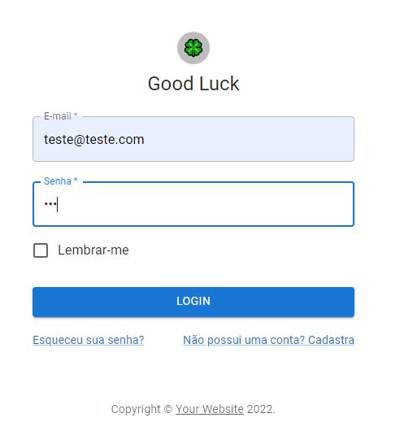
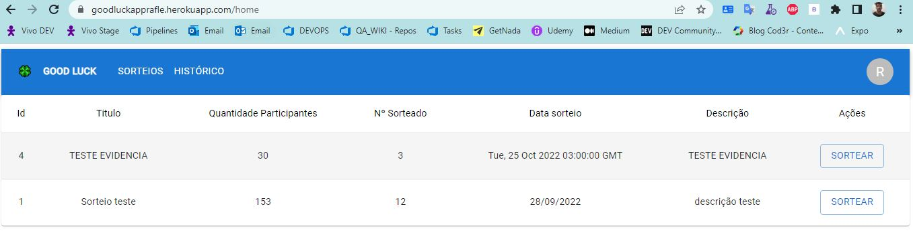

|Caso de Teste            | CT-02 – Realizar cadastro na tela inicial |
|-------------------------|-----------------------------------------|
|Requisitos Associados    | RF-01                                   |
|Objetivo do teste        |O usuário deve poder realizar um cadastro e login no aplicativo |
|Passos                   | 1) Acessar o aplicativo 2) Clicar no botão CADASTRAR 3) Visualizar a tela de cadastro |
|Critérios de Êxito       |A página deve apresentar uma mensagem: “Usuário cadastrado com sucesso” |
|Resultado                | Passos 1, 2, 3  realizados com sucesso.  |
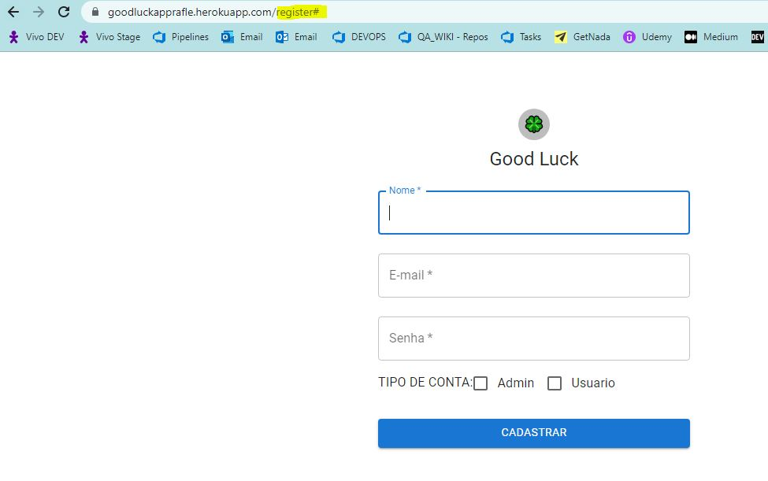

|Caso de Teste            | CT-03 – Realizar cadastro de sorteio |
|-------------------------|-----------------------------------------|
|Requisitos Associados    | RF-03                                   |
|Objetivo do teste        |O usuário deve poder realizar um cadastro de um sorteio |
|Passos                   | 1) Acessar o aplicativo 2) Clicar no botão SORTEIOS 3) Visualizar a tela de sorteios |
|Critérios de Êxito       |A página deve apresentar uma mensagem: “Sorteio cadastrado” |
|Resultado                | Passos 1, 2, 3  realizados com sucesso.  |
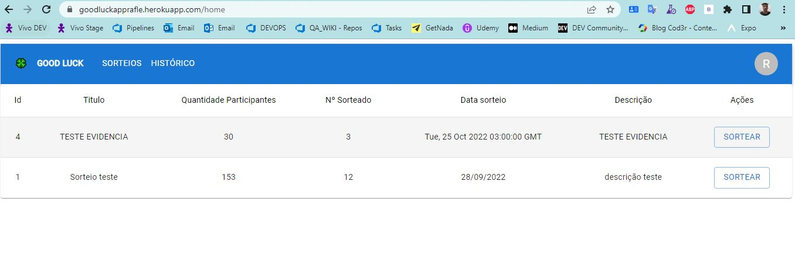
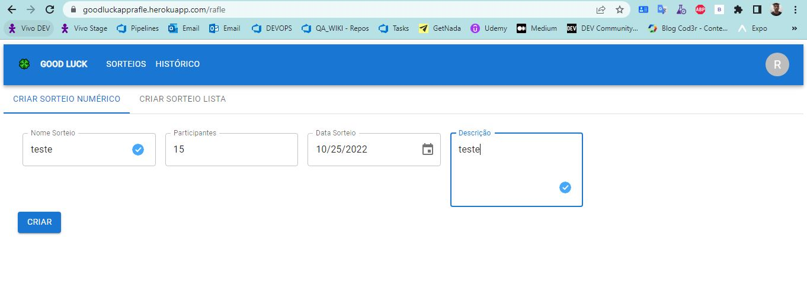
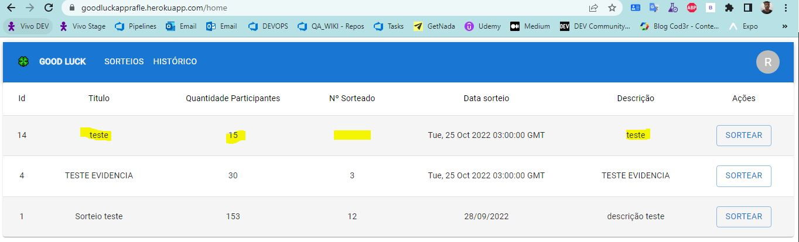

|Caso de Teste            | CT-04 – Tela de gahnadores |
|-------------------------|-----------------------------------------|
|Requisitos Associados    | RF-04                                   |
|Objetivo do teste        |O usuário deve poder visualizar os ganhadores dos sorteios |
|Passos                   | 1) Acessar o aplicativo 2) Clicar no botão HOME 3) Visualizar a tela de HOME |
|Critérios de Êxito       |A página deve apresentar todos os sorteios e seus respectivos numeros sorteados |
|Resultado                | Passos 1, 2, 3  realizados com sucesso.  |
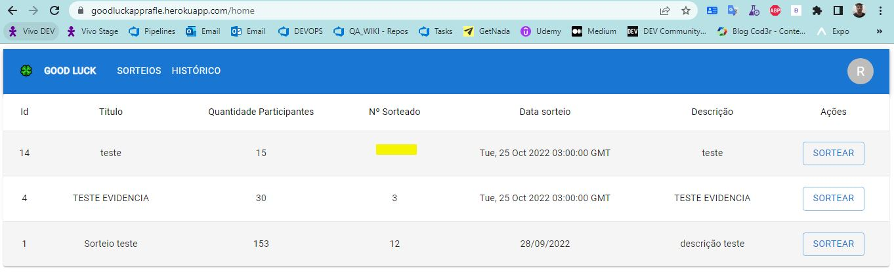
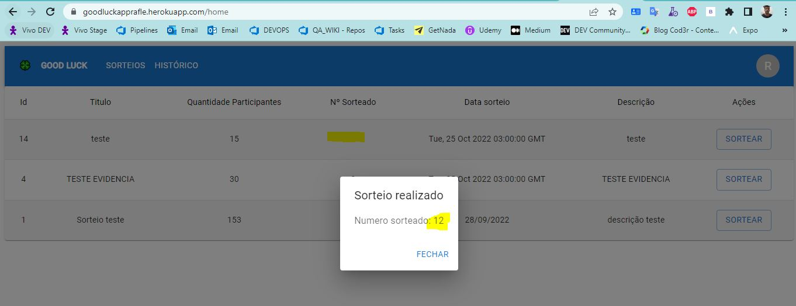
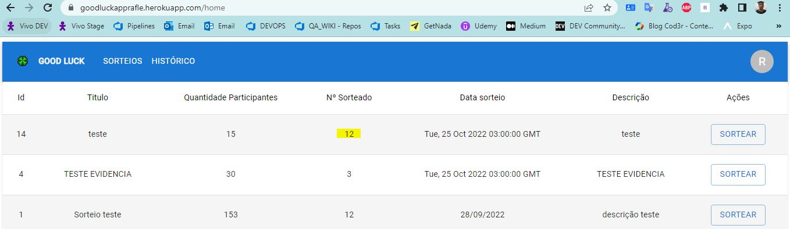

|Caso de Teste            | CT-05 – Visualizar historico de ganhadores |
|-------------------------|-----------------------------------------|
|Requisitos Associados    | RF-05                                   |
|Objetivo do teste        |O usuário deve poder visualizar todos os historicos de ganhadores |
|Passos                   | 1) Acessar o aplicativo 2) Clicar no botão HISTORICO 3) Visualizar a tela de historico |
|Critérios de Êxito       |A página deve apresentar o historico de todos os sorteios realizados |
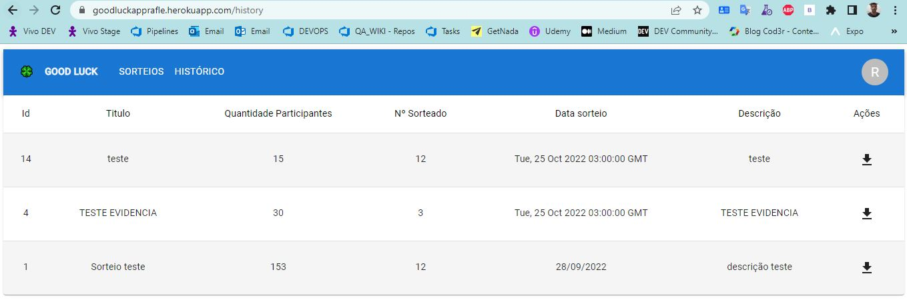

|Caso de Teste            | CT-06 – Download de arquivo de histórico de ganhadores |
|-------------------------|-----------------------------------------|
|Requisitos Associados    | RF-05                                   |
|Objetivo do teste        |O usuário deve poder visualizar todos os historicos de ganhadores |
|Passos                   | 1) Acessar o aplicativo 2) Clicar no botão HISTORICO 3) Visualizar a tela de historico 4) clicar em download|
|Critérios de Êxito       |O documento deve apresentar o historico de todos os sorteios realizados |
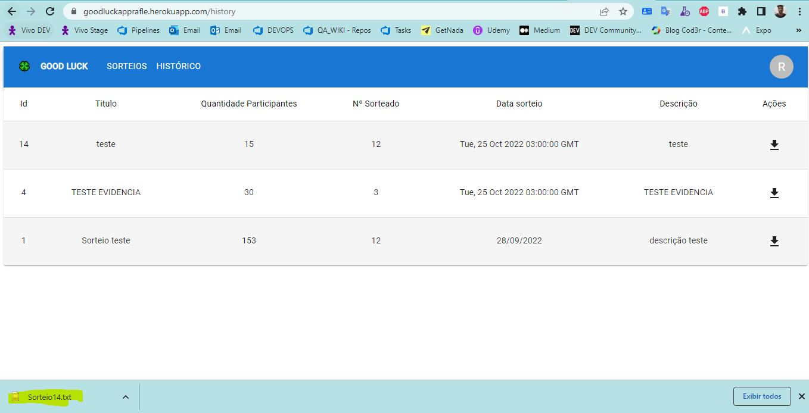
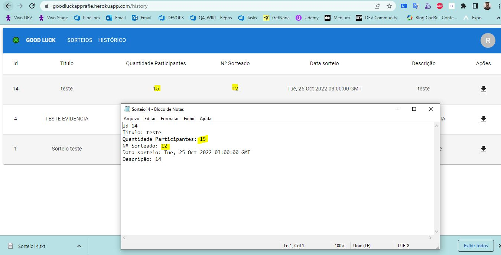

# Registro de Testes de Software MOBILE

|Caso de Teste            | CT-01 – Realizar login na tela inicial  |
|-------------------------|-----------------------------------------|
|Requisitos Associados    | RF-02                                   |
|Objetivo do teste        |O usuário deve poder realizar o login no aplicativo mobile |
|Passos                   | 1) Acessar o aplicativo 2) Visualizar a tela de Login 3) Inserir usuario e senha|
|Critérios de Êxito       |O usuário deve ser direcionado para a tela inicial contendo os menus de sorteio |
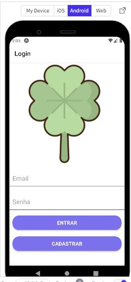
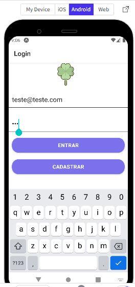
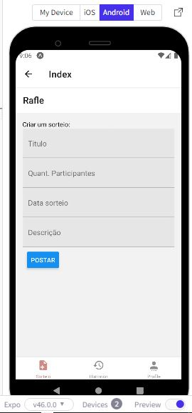

|Caso de Teste            | CT-02 – Realizar cadastro na tela inicial |
|-------------------------|-----------------------------------------|
|Requisitos Associados    | RF-01                                   |
|Objetivo do teste        |O usuário deve poder realizar um cadastro e login no aplicativo mobile |
|Passos                   | 1) Acessar o aplicativo 2) Clicar no botão CADASTRAR 3) Visualizar a tela de cadastro 4)inserir dados do usuário |
|Critérios de Êxito       |O usuario deve ser direcionado para a página de login |

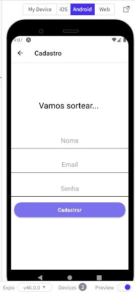

|Caso de Teste            | CT-03 – Realizar cadastro de sorteio |
|-------------------------|-----------------------------------------|
|Requisitos Associados    | RF-03                                   |
|Objetivo do teste        |O usuário deve poder realizar um cadastro de um sorteio |
|Passos                   | 1) Acessar o aplicativo 2) Clicar no botão SORTEIOS 3) Visualizar a tela de sorteios |
|Critérios de Êxito       |A página deve apresentar uma mensagem: “Sorteio cadastrado” |

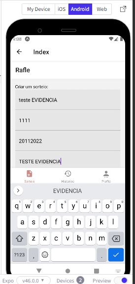
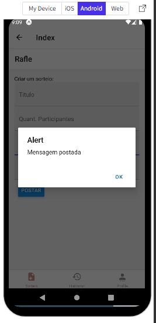
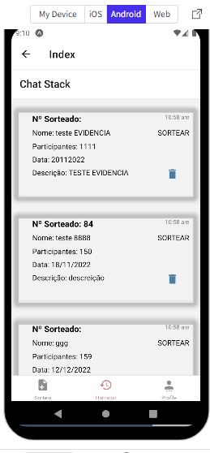

|Caso de Teste            | CT-04 – Visualizar historico de ganhadores |
|-------------------------|-----------------------------------------|
|Requisitos Associados    | RF-05                                   |
|Objetivo do teste        |O usuário deve poder visualizar todos os historicos de ganhadores |
|Passos                   | 1) Acessar o aplicativo 2) Clicar no botão HISTORICO 3) Visualizar a tela de historico |
|Critérios de Êxito       |A página deve apresentar o historico de todos os sorteios realizados |

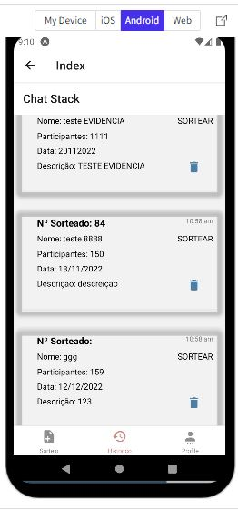

|Caso de Teste            | CT-05 – Autenticação Mobile |
|-------------------------|-----------------------------------------|
|Requisitos Associados    | RF-01                                   |
|Objetivo do teste        |O usuário ser autenticado pela aplicação |
|Passos                   | 1) Acessar o aplicativo 2) Clicar no botão ENTRAR 3) Visualizar a tela inicial |
|Critérios de Êxito       |O console deve apresentar a API autenticação e o usuario deve acessar o aplicativo |
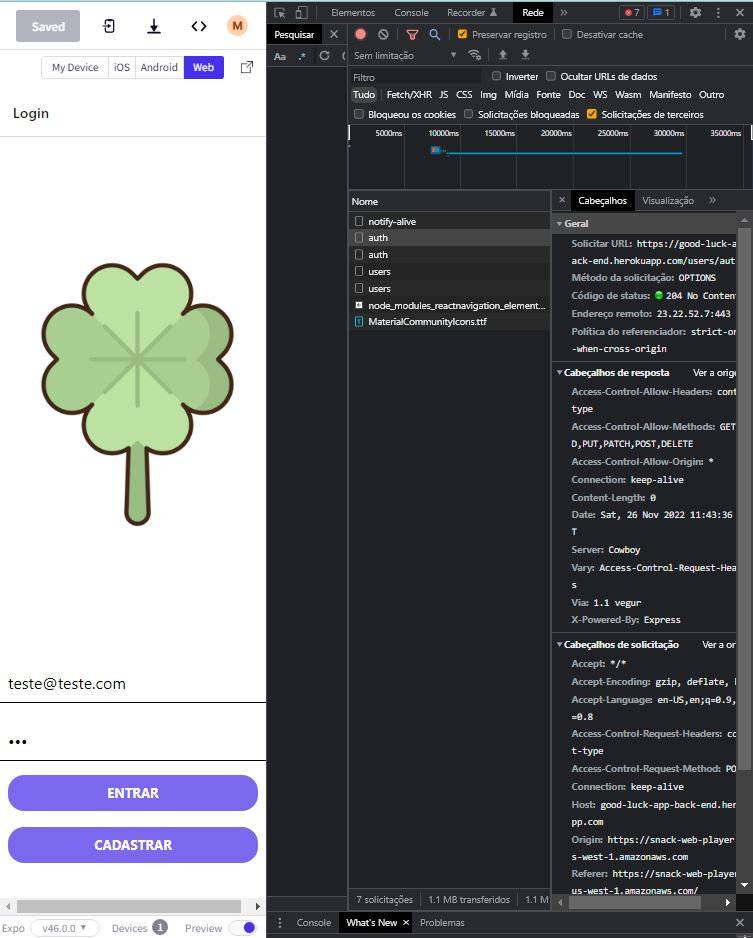
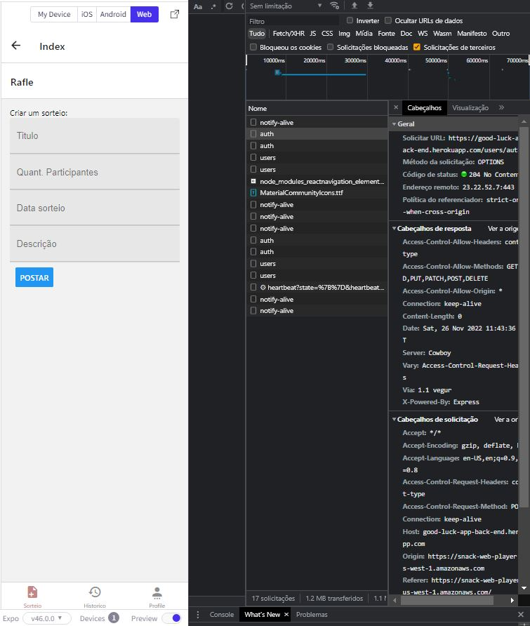